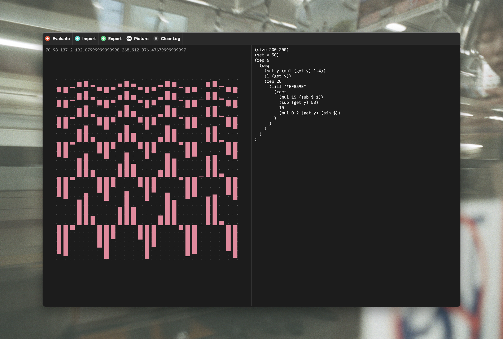

# Playground

This project is a small browser-based procedural graphics tool. It uses a LISP dialect. The generated output is vector-based. It is the procedural sibling of [Canvas](https://github.com/larsaugustin/Canvas).

It’s great for quick ideas and very portable since it doesn’t rely on any dependencies. The simple interpreter can also be used for educational projects.

I created the tool for myself but chose to make it available as free open-source software. If you have any suggestions or improvements, feel free to open an issue or create a pull request.

## Documentation

- [Syntax](documentation/Syntax.md)
- [Standard Library](documentation/Standard_Library.md)
- [Graphics Library](documentation/Graphics_Library.md)

## Links

- [Web version](https://playground.modulator.studio)
- [Contact me](mailto:lars@larztech.com)

## To-Do

- [ ] Lists
- [ ] Automatic indention
- [ ] SVG commands
- [ ] SVG export
- [ ] Touch support
- [ ] Easy way to run it locally

## License

This project is licensed under the MIT license. View `LICENSE` for more info.
